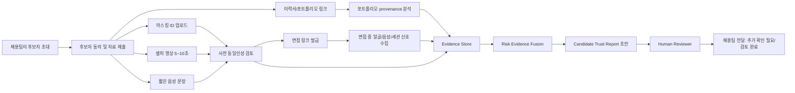
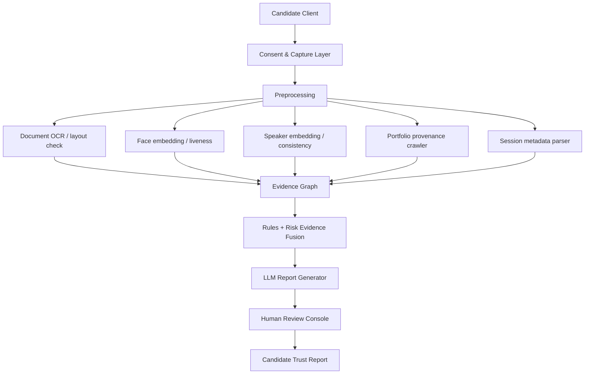

# HireSift 심층 리서치 보고서

## Executive Summary

HireSift는 **원격 채용에서 “화면 속 사람, 제출한 신분, 포트폴리오, 실제 입사자가 같은 사람인가”를 검수하는 AI 기반 신뢰 레이어**로 정의하는 것이 가장 타당하다. 이 문제는 단순한 HR 불편이 아니라, AI 확산으로 인해 **신원 사칭, 대리 면접, 포트폴리오 위조, 인터뷰 무결성 붕괴, 나아가 보안 침투**까지 연결되는 새로운 채용 리스크로 커지고 있다. Checkr는 2025년 미국 관리자 3,000명 조사에서 59%가 AI 기반 허위진술을 의심했고, 31%는 가짜 신원 후보를 직접 인터뷰했으며, 35%는 지원자와 다른 사람이 화상면접에 참여했다고 답했다고 밝혔다. Gartner는 2025년 조사에서 6%의 후보자가 인터뷰 사기를 스스로 인정했고, 2028년이면 전 세계 후보 프로필 4개 중 1개가 가짜일 것으로 전망했다. Microsoft는 2025년 6월 북한 IT worker 계열 위협이 AI 보정 사진, 가짜/도용 신분증, 음성 변조, 가짜 LinkedIn·GitHub 프로필을 활용해 원격 채용을 침투한다고 경고했다. 이 세 축의 증거는 HireSift의 문제 설정이 “너무 이른 문제”가 아니라는 점을 강하게 뒷받침한다. (출처: Checkr, 2025-09-16, 신뢰도 Medium; Gartner, 2025-07-31, 신뢰도 High; Microsoft Threat Intelligence, 2025-06-30, 신뢰도 High) citeturn26view0turn27view0turn28view0

핵심 결론은 분명하다. **HireSift를 “사기 탐지기”로 만들면 안 되고, “추가 검증이 필요한 신호를 묶어 주는 Candidate Trust Report 제품”으로 만들어야 한다.** 그 이유는 첫째, 시장이 실제로 원하는 것은 자동 탈락이 아니라 검토 우선순위화이고, 둘째, 후보자 신뢰와 개인정보 보호에 대한 사회적 저항이 강하며, 셋째, 생체정보·채용AI 영역은 규제 민감도가 높기 때문이다. Gartner는 후보자의 26%만 AI가 자신을 공정하게 평가할 것이라 믿는다고 했고, HireVue의 2025 후보자 조사에서는 79%가 AI 사용 여부 고지를 원했으며 66%는 AI가 최종 결정을 내리는 것에 반대했다. 한국 개인정보보호위원회 자료는 얼굴·지문·홍채·음성 등 식별 목적 생체정보의 엄격한 보호 필요성을 명시한다. 따라서 HireSift의 정답은 **판정 엔진이 아니라 검증 보조 엔진**이다. (출처: Gartner, 2025-07-31, 신뢰도 High; HireVue, 2025-09-02, 신뢰도 Medium; 개인정보보호위원회, 2024-12/해설서, 신뢰도 High) citeturn27view0turn39search15turn33search15turn33search22

사업성은 **좁게 보면 유의미하고, 과장하면 안 된다.** 한국에서의 초기 beachhead는 스타트업/외주사/리크루팅 에이전시로 좁히는 것이 옳다. 다만 HR Tech 전체 시장으로 부풀리지 않고, 실제 검증 대상 후보자 수와 후보자당 검증지출로 계산했을 때 한국 beachhead TAM은 보수적으로는 10억 원대, 기준 시나리오로는 80억 원대, 공격적으로는 400억 원대 후반 정도로 해석하는 것이 적절하다. 이는 거대한 범용 HR 플랫폼 시장이 아니라, **“고위험 원격 채용 검증”이라는 뾰족한 B2B SaaS 서브카테고리**로 이해하는 편이 맞다. 가격 측면에서는 Checkr ID Verification가 $4.99/check, 기본 백그라운드체크가 $29.99/report, Spark Hire가 $249/월부터, Persona가 $250/월부터, Veriff는 공개 G2 기준 $1.39/verification와 월 최소 $99를 제시하고 있어, HireSift가 **월 구독 + 후보자 패키지 혼합 요금제**를 설계할 여지는 충분하다. (출처: Checkr, 2026-05 접근, 신뢰도 High; Spark Hire, 2026-05 접근, 신뢰도 High; Persona, 2026-05 접근, 신뢰도 High; G2 Veriff Pricing, 2025-10 기준 노출, 신뢰도 Medium) citeturn37view0turn34view0turn35view0turn20search7

실행 판단은 **“진행할 만하다. 단, 제품 정체성을 좁혀야 한다”**이다. 3개월 MVP는 충분히 가능하다. 가장 우선해야 할 기능은 세 가지다. **마스킹 ID + 셀피 기반 사전 동일인성 검증, 면접 중 얼굴·음성·세션 메타데이터 일관성 검토, 포트폴리오 provenance 요약 리포트**다. 반대로 초기 단계에서 제외해야 할 것은 **거짓말 탐지, 감정 추론, 성격 분석, 자동 탈락, 풀 백그라운드체크 대체, 무거운 ATS 양방향 통합**이다. 투자/멘토링 문맥에서 가장 설득력 있는 한 문장은 다음과 같다. **“HireSift는 채용팀이 후보자를 자동 판정하는 도구가 아니라, 원격 채용에서 신원·포트폴리오·면접 무결성을 검토할 수 있게 해 주는 AI Trust Layer다.”**

| 평가 항목 | 판단 |
|---|---|
| 증거 신뢰도 | 높음 |
| 문제 심각도 | 높음 |
| 지불 가능성 | 중상 |
| 3개월 MVP 가능성 | 중상 |
| 컴퓨터 비전 적합도 | 높음 |
| Physical AI 적합도 | 중간 |
| 개인정보·법적 리스크 | 높음 |
| 차별화 가능성 | 중상 |
| 확장성 | 중상 |

## 서비스 명명과 문제 정의

**Naming / Service Thesis**

**HireSift**

“Hire”는 채용 맥락을 즉시 드러내고, “Sift”는 소음을 걸러 핵심 신호를 남긴다는 인상을 준다.

**Service Thesis**  
원격 채용에서 후보자의 **신원, 제출 자료, 포트폴리오, 인터뷰 세션** 사이의 일관성을 AI로 정리해 주고, 채용 담당자가 **“추가 검증이 필요한 신호”**를 빠르게 파악하도록 돕는 Human-in-the-loop Trust Layer.

**One-line Description**  
원격 채용에서 **화면 속 사람과 입사할 사람이 같은지** 검토할 수 있게 해 주는 Candidate Trust Report SaaS.

**추천 태그라인**
- Trust before access.
- Verify the person behind the profile.
- Remote hiring, reviewed with evidence.

**What It Is Not**
- 거짓말 탐지기 아님
- 자동 탈락 시스템 아님
- 감정·심리 추론 도구 아님
- 풀 백그라운드체크 대체재 아님

**Problem Definition**

문제는 “AI가 채용을 도와준다”가 아니라, **AI가 후보자 위·변조 비용을 극적으로 낮췄다**는 데 있다. Checkr 조사에서 59%가 AI를 이용한 허위진술을 의심했고, 62%는 구직자 쪽이 기업보다 AI 신분 위조에 더 능하다고 답했다. Gartner는 39%의 후보자가 지원 과정에서 AI를 사용한다고 밝혔고, 같은 해 2Q25 조사에서 6%는 인터뷰 사기에 직접 가담했다고 인정했다. Microsoft는 AI-enhanced 사진, fake/stolen IDs, voice-changing software, LinkedIn·GitHub·Upwork 기반 가짜 디지털 풋프린트 구축이 실제 공격 전술임을 공개했다. 즉, 원격 채용은 이제 **“서류 심사 + 면접”이 아니라 “identity surface review”**가 되어 버렸다. (출처: Checkr, 2025-09-16, 신뢰도 Medium; Gartner, 2025-07-31, 신뢰도 High; Microsoft Threat Intelligence, 2025-06-30, 신뢰도 High) citeturn26view0turn27view0turn28view0

왜 지금 중요한가도 명확하다. OECD에 따르면 EU7 공공부문 기준 43%가 주 단위 원격근무를 하고 있고, Upwork는 2025년 미국 skilled knowledge workers의 28%가 프리랜싱/독립형으로 일한다고 밝혔다. 한국에서도 2024년 기준 원격근무제 도입 사업체 비율 8.3%, 재택근무제 도입 비율 9.7%가 확인된다. 동시에 한국은 2025년 기술기반 창업기업이 221,063개, 1인 창조기업이 116만 개 수준으로 분산형 업무·외주 생태계가 넓다. 즉, **원격 채용 + 외주 + 프리랜서 조달 + AI 생성 조작**이 한 지점에서 만나고 있다. (출처: OECD, 2025-09-11, 신뢰도 High; Upwork Research Institute, 2025-04-23, 신뢰도 High; KOSIS/고용노동부 응답, 2024-10-31/2025 공개, 신뢰도 Medium; 중소벤처기업부, 2026-01-06 보도, 신뢰도 High; 1인창조기업 실태조사/KOSIS 검색결과, 2025 공개, 신뢰도 Medium) citeturn17search0turn17search11turn13search5turn8search4turn8search2

**증거 기반 페인포인트 5개**

| 페인포인트 | 실제로 무슨 일이 일어나는가 | 회사에 생기는 비용/리스크 |
|---|---|---|
| 인터뷰에 나온 사람과 실제 지원자가 같지 않을 수 있음 | 가짜 신원·대리 면접·deepfake candidate | 잘못된 채용, 보안 침투, 재채용 비용 |
| 포트폴리오·프로필의 진위를 사람이 수동으로 확인하기 어려움 | 가짜 LinkedIn/GitHub/Behance, AI 보정 이미지, 얇은 활동 이력 | 심사 시간 증가, 잘못된 shortlist |
| 현재 스택으로도 확신을 못 가짐 | ID 확인·실시간 면접·백그라운드 체크를 써도 신뢰 부족 | 검증 중복 비용, 운영 피로 |
| 리스크가 HR 문제가 아니라 보안 문제로 번짐 | 원격 채용 경유 계정 접근, IP/소스코드 유출, extortion | 법무·ISMS·고객 신뢰 훼손 |
| 대응책이 다시 오프라인 회귀가 됨 | 대면 final round, task-based 검증 강화 | 원격 채용 속도와 접근성 저하 |

이 표를 뒷받침하는 가장 강한 근거는 다음과 같다. Checkr는 관리자 31%가 가짜 신원 후보를 인터뷰했고 35%는 지원자와 다른 사람이 virtual interview에 참여했다고 답했으며, 23%는 지난 1년 hiring fraud로 5만 달러 초과 손실을 경험했다고 밝혔다. 또한 현재 ID checks(58%), real-time video interviews(55%), third-party background checks(52%)를 쓰고도 “현재 프로세스가 fraudulent applicant를 잡아낼 것”에 대해 매우 자신 있다는 응답은 19%뿐이었다. 이는 **문제가 “도구 없음”이 아니라 “도구 단절”**에 있음을 보여 준다. (출처: Checkr, 2025-09-16, 신뢰도 Medium) citeturn26view0

Gartner는 2025년 조사에서 6%의 후보자가 인터뷰 사기를 인정했고, 2028년까지 후보 프로필의 25%가 가짜가 될 것이라고 전망했다. 또한 채용팀에 대해 “system-level validation”과 identity verification, anomaly alerts의 내재화를 권고했다. 이는 HireSift의 제품 정의가 “부정행위 탐지”보다 **검증 레이어 내재화**에 더 가깝다는 점을 정당화한다. (출처: Gartner, 2025-07-31, 신뢰도 High) citeturn27view0

Microsoft는 북한 IT worker들이 AI로 사진을 바꾸고, 음성 변조를 실험하고, 가짜 LinkedIn·GitHub 프로필을 구축하며, facilitator를 통해 면접과 장비 수령을 우회한다고 밝혔다. 이는 HireSift가 document check만 하면 안 되고, **포트폴리오 provenance + 실시간 세션 무결성 + 입사 전후 동일인성**을 함께 봐야 함을 의미한다. (출처: Microsoft Threat Intelligence, 2025-06-30, 신뢰도 High) citeturn28view0

Google과 Teach First가 AI-assisted cheating 증가를 이유로 대면 인터뷰를 되돌리고 있는 점도 중요하다. 이는 현재 시장이 비용이 더 드는 오프라인 검증으로 후퇴하고 있다는 뜻이며, HireSift가 **“원격을 포기하지 않고도 신뢰도를 올리는 대안”**이 될 수 있음을 시사한다. (출처: HCAMag/HRD Connect 계열 보도, 2025-08-12, 신뢰도 Medium; The Guardian, 2025-07-13, 신뢰도 High) citeturn30search4turn30news30

**Problem Boundary**

이 문제를 “가짜 지원자 탐지”가 아니라 “신원·자료·인터뷰 일관성 검수”로 정의해야 하는 이유는 두 가지다. 첫째, **법적·윤리적 안전성**이다. 개인정보보호위 해설은 얼굴·음성 등 식별 목적 생체정보를 민감하게 다루도록 요구하고 있고, 유럽 집행위원회의 AI Act 가이드라인은 workplace emotion recognition 같은 영역을 금지된 관행으로 다룬다. 둘째, **시장 수용성**이다. 후보자들은 AI의 최종 판정을 원하지 않는다. HireVue가 공개한 2025 후보자 조사에서도 66%가 AI의 final call에 반대했다. 따라서 HireSift의 산출물은 “가짜입니다”가 아니라 **“추가 확인이 필요한 위험 신호가 있습니다”**여야 한다. (출처: 개인정보보호위원회, 2024-12/해설서, 신뢰도 High; European Commission, 2025-02-04 가이드라인, 신뢰도 High; HireVue, 2025-09-02, 신뢰도 Medium) citeturn33search15turn33search22turn6search23turn39search15

## 고객과 경쟁 구도

**2C Analysis — Customer**

초기 고객 범위는 요청하신 대로 세 그룹으로만 유지하는 것이 맞다. 다만 세 그룹 안에서도 **반복 볼륨이 높은 고객**과 **문제 강도가 가장 큰 고객**을 구분해야 한다.

| 고객군 | 왜 이 문제가 여기서 자주 터지는가 | 구매결정자 | 돈을 낼 가능성이 생기는 순간 | 도입 저항 |
|---|---|---|---|---|
| 원격 개발자 채용 스타트업 | 빠른 채용, 소규모 HR, 비대면 기술면접 의존 | Founder / People Lead / Hiring Manager | 후보 진위 검증 시간 절감 + 보안 리스크 감소가 체감될 때 | 개인정보·후보 경험 악화 우려 |
| 디자이너·크리에이티브 인력 원격 채용 외주사 | 포트폴리오·실력·실제 작업자 동일성 확인이 어려움 | 대표 / PM / Ops | 고객사 클레임·납기 리스크를 줄일 수 있을 때 | “우리 눈으로 보면 알 수 있다”는 관성 |
| 리크루팅 에이전시 | 고객사에 대신 검수 책임을 져야 하고 반복 볼륨이 큼 | 팀장 / Delivery Lead / Agency Owner | 후보 검수 품질을 차별화 포인트로 상품화할 수 있을 때 | 기존 워크플로우 변경, 책임소재 우려 |

이 세 고객군의 근거는 다음과 같다. 한국에는 2025년 기술기반 창업기업이 221,063개 존재하고, 원격근무·재택근무 도입도 이미 확인된다. 또한 한국 고용노동부는 2025년 기준 `국내 유료직업소개소 현황`을 별도 공개하고 있어, 리크루팅 에이전시 채널이 제도권 시장으로 존재함을 보여 준다. Staffing Industry Analysts는 2026년 초 보도에서 staffing buyers의 41%가 candidate fraud challenge를 겪고 있다고 전했다. 즉, एजেন্সી는 “있으면 좋은 도구”가 아니라 **클라이언트 리스크를 대신 떠안는 채널**이다. (출처: 중소벤처기업부, 2026-01-06, 신뢰도 High; KOSIS/고용노동부 응답, 2024-10-31/2025 공개, 신뢰도 Medium; 고용노동부, 2025-08-25 공개목록, 신뢰도 High; Staffing Industry Analysts 보도, 2026-02-03/04, 신뢰도 Medium) citeturn8search4turn13search5turn23view0turn25search0turn25search2

**Initial Beachhead Recommendation**

세 고객군 중 첫 번째로 가장 추천되는 beachhead는 **리크루팅 에이전시와 원격 외주사**다. 이유는 문제 빈도, 동일 프로세스 반복성, 후보 검증을 부가가치로 재판매할 가능성 때문이다. 스타트업은 pain은 크지만 예산/운영 관성이 낮고, 리크루팅 에이전시는 pain과 volume이 함께 있다. 다만 초기 인터뷰 표본은 세 그룹을 모두 포함해야 한다. 첫 30인터뷰는 **에이전시 10 / 외주사 10 / 스타트업 10** 구성이 가장 좋다.

**2C Analysis — Competitor**

시장에는 HireSift와 완전히 동일한 제품이 아직 거의 없다. 대신 **백그라운드 체크, ID verification, video interviewing, ATS, AI interview/assessment**가 각자 조각난 상태로 존재한다. 아래 표는 HireSift의 실제 대체재에 가깝다.

| 서비스 | 국가 | 핵심 기능 | 과금/가격 | HireSift와 겹치는 부분 | 해결하지 못하는 공백 | 리뷰 기반 약점 |
|---|---|---|---|---|---|---|
| Checkr | 미국 | 배경조회, ID verification, 고용·학력 검증 | Basic $29.99/report, ID verification $4.99/check citeturn37view0 | 후보 ID 확인, 기본 검증 리포트 | 면접 중 동일인성, 포트폴리오 provenance, 세션 무결성 | 지연·지원 이슈 — “unreliable timeframes… weeks…” citeturn40search0 |
| Persona | 미국 | workforce IDV, selfie, document AI, fraud signals, workflow | Essential $250/월부터, 12개월 최소, volume-based citeturn35view0 | 인력 ID verification, redaction/retention | 채용용 live interview integrity, 포트폴리오 검수, HR report UX | 비용·복잡성 — “expensive”, “verification … would not work” 요약 citeturn19search14 |
| Veriff | 에스토니아/글로벌 | document + selfie + liveness + network/device analytics | 공식은 custom/actual sessions 기반, G2 공개값 $1.39/verification + $99 minimum citeturn36view0turn20search7 | 실시간 IDV, liveness, device/network signals | HR workflow, 포트폴리오 provenance, 입사 전·중·후 stitching | 비용·retry·현지문서 이슈 citeturn20search1 |
| Spark Hire | 미국 | one-way/live video interview, ATS, reference checks | video interview $249/월부터, ATS $299/월부터 citeturn34view0 | 면접 수집, 영상 기록, 채용 workflow | 인터뷰 참가자 진위, 신분증·셀피 일치, 포트폴리오 진위 | “robotic and foreign at first” citeturn19search6 |
| HireVue | 미국 | AI-powered interviewing, assessment, scheduling, scale hiring | 공식 가격은 demo 문의형, 후보자 무료/NPS 71 citeturn38view0 | 대규모 면접/평가, candidate workflow | dedicated identity consistency layer, privacy-preserving trust report | “can feel impersonal… especially in one-way” citeturn19search8 |

이 표에서 가장 중요한 인사이트는 **직접 경쟁이 아니라 조합 경쟁**이라는 점이다. Checkr/Persona/Veriff는 신원을 보고, Spark Hire/HireVue는 면접을 보고, 누구도 **신분증-셀피-화상면접-포트폴리오-세션 메타데이터를 하나의 HR-native trust report로 묶어 주지 않는다.** 이것이 HireSift의 핵심 공백이다. (출처: Checkr pricing, 2026-05 접근, 신뢰도 High; Persona pricing, 2026-05 접근, 신뢰도 High; Veriff product pages, 2026-05 접근, 신뢰도 High; Spark Hire pricing, 2026-05 접근, 신뢰도 High; HireVue pricing/home, 2026-05 접근, 신뢰도 High) citeturn37view0turn35view0turn36view0turn34view0turn38view0turn38view1

**Customer Persona / JTBD**

| 페르소나 | 상황 | 가장 큰 두려움 | 기존 해결책 | 구매 트리거 | JTBD |
|---|---|---|---|---|---|
| 스타트업 People Manager | 5명도 안 되는 팀이 원격 개발자 급히 채용 | 잘못 뽑아도 바로 보안/속도 문제 | 면접 + GitHub 수동 확인 + 레퍼런스 | final round 이전 “확인 팩”이 필요할 때 | When remote interviews feel unreliable, I want a fast trust review so I can hire without losing speed. |
| 외주사 대표/PM | 디자이너·프리랜서를 원격으로 붙여야 함 | 포트폴리오 주인과 실제 작업자가 다를까 봄 | 포폴 수동 검토, 짧은 task | 클라이언트 납기·품질 리스크가 커질 때 | When I contract remote creatives, I want proof that the portfolio owner and actual worker are the same person so I can protect delivery quality. |
| 리크루팅 에이전시 Delivery Lead | 고객사 대신 후보 검수 책임을 짐 | 가짜 후보를 보내 agency 신뢰가 깨짐 | ID 수동 요청, 화상면접 녹화, 레퍼런스 | “우리 agency는 검수까지 한다”를 팔고 싶을 때 | When clients expect trustworthy shortlists, I want a reusable trust-check workflow so I can reduce disputes and win repeat business. |

이 페르소나는 전부 “미래의 AI 채용”을 원하는 게 아니다. 오히려 **검수 부담을 줄이고 책임소재를 명확히 하고 싶어 한다.** Checkr와 SIA 근거를 합치면, 실제 구매 동인은 efficiency보다 **risk containment**에 가깝다. (출처: Checkr, 2025-09-16, 신뢰도 Medium; SIA 보도, 2026-02, 신뢰도 Medium) citeturn26view0turn25search0turn25search2

**Existing Alternatives & Gap**

| 현재 대안 | 장점 | 한계 |
|---|---|---|
| 수동 신분증 확인 | 가장 직관적 | 저장·보안 이슈, 사진 진위 한계 |
| Zoom/Meet 면접 녹화 | 기존 도구 그대로 사용 | 대리 면접·off-camera assistance 탐지 한계 |
| LinkedIn/GitHub/Behance 수동 확인 | 추가 비용 낮음 | 위조·짧은 활동 이력 구분 어려움 |
| Reference/과제 테스트 | 실력 검증 일부 가능 | 동일인성 문제는 해결 못함 |
| 배경조회/IDV 도구 | 문서·규정 준수 강점 | 채용 workflow와 live session stitching 부족 |
| 대면 final round | 가장 강한 동일인성 검증 | 원격 채용 장점 상실 |

반복적으로 보이는 미해결 문제는 다섯 가지다. 첫째, **cross-stage stitching이 없다.** 둘째, **포트폴리오 provenance를 자동으로 보지 못한다.** 셋째, **identity tool과 interview tool이 서로 분리돼 있다.** 넷째, **candidate experience가 차갑거나 friction이 크다.** 다섯째, **판정 로직이 후보자에게 설명 가능하지 않다.** Spark Hire/HireVue 리뷰의 “robotic”, “impersonal”, Checkr의 지연/지원 이슈, Veriff·Persona의 비용/실패 사례는 모두 이 공백을 강화한다. (출처: Capterra/G2 리뷰 페이지, 2025~2026 접근, 신뢰도 Medium-Low) citeturn40search0turn19search6turn19search8turn20search1turn19search14

## 포지셔닝과 시장성

**Value Proposition / Positioning**

HireSift의 포지셔닝은 다음 한 문장으로 가장 잘 정리된다.

> **HireSift는 자동 사기 판별기가 아니라, 원격 채용에서 신원·포트폴리오·면접 일관성을 검토해 주는 AI-powered trust layer다.**

이 메시지가 중요한 이유는 시장이 이미 “AI가 최종 판단하는 채용”에 대해 불안해하기 때문이다. Gartner는 후보자의 AI 불신을 확인했고, HireVue도 다수 후보자가 AI의 final call을 원하지 않는다고 공개했다. 따라서 HireSift가 써야 할 문구는 “fraud detected”가 아니라 **“additional verification recommended”**, “red flag found”가 아니라 **“review signal found”**에 가깝다. (출처: Gartner, 2025-07-31, 신뢰도 High; HireVue, 2025-09-02, 신뢰도 Medium) citeturn27view0turn39search15

**메시지 Do / Don’t**

| Do | Don’t |
|---|---|
| 추가 검증이 필요한 신호를 보여준다 | 거짓말을 잡아낸다고 말하지 않는다 |
| 후보자 자동 탈락 금지, 최종 판단은 인간 | fraud score로 자동 판정하지 않는다 |
| ID·포트폴리오·면접 세션의 일관성 검토 | 감정·심리·성격 분석을 하지 않는다 |
| 최소수집·마스킹·보관기간 제한 | 원본 ID/영상 장기 저장을 기본값으로 두지 않는다 |

**TAM / SAM / SOM**

시장 계산은 **한국 beachhead bottom-up**으로 잡는 것이 가장 정직하다. 글로벌 시장 숫자를 억지로 합산하는 것보다, 실제 ICP가 매년 몇 명의 후보를 검증해야 하는지 보는 편이 낫다. 공식 근거로는 한국 기술기반 창업기업 221,063개, 한국 원격근무제 도입 8.3%·재택근무제 9.7%, 국내 유료직업소개소 현황 공개가 있다. 다만 **외주사/리크루팅 에이전시의 정확한 machine-readable 총수는 이번 조사 범위에서 충분히 확보되지 않아 가정 기반 추정**을 일부 사용했다. (출처: 중소벤처기업부, 2026-01-06, 신뢰도 High; KOSIS/고용노동부 응답, 2024-10-31/2025 공개, 신뢰도 Medium; 고용노동부, 2025-08-25, 신뢰도 High) citeturn8search4turn13search5turn23view0

**계산식**

- **TAM = 연간 검증 대상 후보자 수 × 후보자 1명당 연간 검증 지출액**
- **SAM = TAM × 초기 서비스 가능 비율**
- **SOM = SAM × 3년 내 현실적 점유율**

후보자당 지출액 가정은 비교 가능한 공개 가격을 기준으로 잡았다. Checkr의 ID verification은 $4.99, 기본 background check는 $29.99, Spark Hire는 $249/월, Persona는 $250/월부터다. HireSift는 이 전체를 대체하지 않으므로, 후보자당 지출은 **₩15,000 / ₩25,000 / ₩40,000**의 보수·기준·공격 시나리오로 잡는 것이 자연스럽다. 이 지출액은 공개 시장가 대비 무리하지 않은 수준이다. (출처: Checkr, 2026-05 접근, 신뢰도 High; Spark Hire, 2026-05 접근, 신뢰도 High; Persona, 2026-05 접근, 신뢰도 High) citeturn37view0turn34view0turn35view0

| 시나리오 | 가정된 연간 검증 대상 후보자 수 | 후보자당 지출액 | TAM | 서비스 가능 비율 | SAM | 3년 점유율 | SOM |
|---|---:|---:|---:|---:|---:|---:|---:|
| 보수적 | 73,055명 | ₩15,000 | ₩1.10B | 35% | ₩0.38B | 0.1% | ₩0.38M |
| 기준 | 333,957명 | ₩25,000 | ₩8.35B | 50% | ₩4.17B | 1.0% | ₩41.7M |
| 공격적 | 1,165,921명 | ₩40,000 | ₩46.64B | 65% | ₩30.31B | 3.0% | ₩909.4M |

**가정 상세**
- 보수적: 기술기반 창업기업의 3%가 원격 고위험 채용 검증 수요 보유, 액티브 고객당 연 2 role, role당 4명 검증 + 외주/에이전시 500개사 가정
- 기준: 5%, 연 3 role, role당 6명 + 외주/에이전시 1,500개사
- 공격적: 8%, 연 4 role, role당 8명 + 외주/에이전시 3,000개사  
여기서 **스타트업 모수는 공식 수치**, 나머지 role 수·candidate per role·agency 수는 **가정 기반 추정**이며 신뢰도는 Low다.

해석은 이렇게 해야 한다. 한국만 보면 HireSift는 **초대형 범용 SaaS**가 아니라 **risk-sensitive recruiting utility**다. 그러나 이 정도 TAM은 작은 팀이 좁은 wedge로 시작해도 되는 규모다. 특히 SOM의 숫자가 낮아 보이는 이유는 점유율을 과장하지 않았기 때문이다. 실제로 HireVue, Persona, Spark Hire 계열은 모두 **교육/도입/설정/보안 검토가 필요한 enterprise-ish buying motion**을 갖고 있어, 초기 3년 점유율을 공격적으로 잡는 것이 오히려 부정확하다. (출처: Spark Hire, 2026-05 접근, 신뢰도 High; Persona, 2026-05 접근, 신뢰도 High; HireVue, 2026-05 접근, 신뢰도 High) citeturn34view0turn35view0turn38view0

**Revenue Model Benchmark**

| 서비스 | 가격 패턴 | 과금 단위 | 공개 지표/메모 |
|---|---|---|---|
| Checkr | $29.99/report부터, IDV $4.99/check | 후보자당 | 엔터프라이즈형 옵션 있음 citeturn37view0 |
| Spark Hire | $249/월(video), $299/월(ATS) | 월 구독 | ATS 700+ 조직 사용 citeturn34view0 |
| Persona | $250/월부터 + volume-based | 월 구독 + 검증량 | 12개월 최소, 성공 검증 기준 청구 언급 citeturn35view0 |
| Veriff | custom + session 기반, 공개 G2 기준 $1.39/verification + $99 min | 검증당 + 월 최소 | 실제 세션만 과금 철학 강조 citeturn36view0turn20search7 |
| HireVue | 공개 자료 없음, demo 문의형 | 엔터프라이즈 계약형 | 후보자 무료, candidate NPS 71 citeturn38view0 |

이 벤치마크로 보면 HireSift의 가장 현실적인 가격 가설은 **월 구독 + 검증 패키지**다. 권장 가설은 다음과 같다.

| 요금제 가설 | 월 요금 | 포함량 | 대상 |
|---|---:|---|---|
| Starter | ₩290,000 | 월 20건 Candidate Trust Report | 소규모 스타트업 |
| Growth | ₩790,000 | 월 75건 + 팀 리뷰 워크플로우 | 외주사/채용팀 |
| Agency | ₩1,990,000 | 월 250건 + client-ready export | 리크루팅 에이전시 |
| Overage | ₩12,000~₩20,000/건 | 추가 검증 | 변동 채용량 대응 |

이 가격은 Spark Hire/Persona의 월 진입가격과 정합적이고, Checkr식 per-candidate economics와도 맞물린다. 핵심은 HireSift가 **“background check cheaper alternative”가 아니라 “trust review add-on”**으로 팔려야 한다는 점이다.

## MVP와 데이터 아키텍처

**MVP Scope**

3개월 MVP는 **면접 전 검증 → 면접 중 검증 → 면접 후 Candidate Trust Report**의 3단계가 가장 적절하다. Full KYC나 full background check로 가면 scope가 무너진다.

| 우선순위 | 기능 | 왜 필요한가 |
|---|---|---|
| P0 | 마스킹 ID + 셀피 + 기본 face match | 인터뷰 이전 동일인성 기준선 생성 |
| P0 | 면접 중 랜덤 발화 + 얼굴/음성/세션 로그 캡처 | 대리 면접·세션 치환 탐지 근거 확보 |
| P0 | 포트폴리오 provenance 요약 | LinkedIn/GitHub/Behance/Git repo의 얇은 흔적 여부 표시 |
| P1 | LLM 기반 Candidate Trust Report 생성 | 채용팀이 바로 읽을 수 있어야 함 |
| P1 | Human reviewer console | 자동 탈락 금지/HITL 필수 |
| P2 | ATS export / webhook | 후순위 |
| Out of Scope | 감정분석, 성격분석, 풀 background check, 자동 reject | 가드레일 위반 또는 scope 과다 |

**권장 3개월 로드맵**

| 기간 | 산출물 |
|---|---|
| 1~2주 | 문제 인터뷰, 리포트 템플릿, 법적 체크리스트, 수집 최소화 설계 |
| 3~4주 | candidate upload flow, masked ID ingestion, selfie capture, consent flow |
| 5~6주 | face consistency, voice consistency, session metadata logging, portfolio fetcher |
| 7~8주 | rules + evidence fusion, reviewer console, report draft |
| 9~10주 | design partner test, false-flag tuning, privacy UX 문구 고도화 |
| 11~12주 | paid pilot 제안서, export/report polishing, go/kill decision |

**User Flow**

이 흐름의 핵심은 **판정보다 증거 연결**이다. Gartner와 Microsoft가 강조한 방향도 system-level validation과 multi-layer mitigation이므로, HireSift의 UX는 “결론”보다 “검토 근거 묶음”에 초점을 둬야 한다. (출처: Gartner, 2025-07-31, 신뢰도 High; Microsoft, 2025-06-30, 신뢰도 High) citeturn27view0turn28view0

**Candidate Trust Report 샘플**

| 섹션 | 예시 출력 |
|---|---|
| Candidate Identifier | HS-2026-0041 / 이름·ID번호는 마스킹 |
| Identity Consistency | 제출 이름, 이메일, 포트폴리오 계정명은 대체로 일치 |
| Face Match | 사전 셀피와 면접 세션의 얼굴 일관성은 전반적으로 유사하나, 일부 프레임은 추가 확인 필요 |
| Voice Consistency | 짧은 음성 샘플과 면접 발화의 기초 일관성은 확보되었으나 샘플 길이 부족으로 확정 불가 |
| Portfolio Provenance | GitHub 주요 repo 활동이 지원 직전 7일에 집중되어 있어 추가 확인 권장 |
| Session Integrity | IP/디바이스 정보에 중대한 이상 없음 / 카메라 품질 저하 프레임 존재 |
| Recommended Action | 자동 탈락 금지. 5분 재검증 콜과 포트폴리오 walkthrough 요청 권장 |

**중요 문구 예시**  
“사기 여부를 단정하지 않습니다. 아래 신호는 채용팀의 추가 검토를 위한 참고 자료입니다.”

**Data Structure / AI Architecture**

권장 엔티티 구조는 아래와 같다.

| 엔티티 | 핵심 필드 |
|---|---|
| candidate | candidate_id, consent_status, retention_expiry |
| application | role_id, recruiter_id, created_at |
| id_artifact | masked_doc_type, extracted_name_hash, doc_check_flags |
| selfie_session | face_embedding_ref, liveness_flags, capture_quality |
| voice_sample | speaker_embedding_ref, duration, quality_score |
| portfolio_asset | platform, url, account_age_hint, activity_signals |
| interview_session | session_id, device_hash, ip_region_hint, frame_quality |
| risk_signal | signal_type, severity_band, explanation, evidence_ref |
| trust_report | report_id, summary_text, reviewer_status, recommended_action |
| audit_log | reviewer_id, action, timestamp |

**Privacy-by-Design Checklist**

한국 개인정보 규범상 얼굴·음성은 식별 목적에서 생체정보로 취급될 수 있으므로, HireSift는 “많이 모으는 제품”이 아니라 **덜 모으는 제품**이어야 한다. (출처: 개인정보보호위원회, 2024-12/해설서, 신뢰도 High) citeturn33search15turn33search22

- 명시적 동의와 목적 고지
- 신분증 원본 전체 저장 금지, 필요한 항목만 마스킹 추출
- 원본 영상 장기 저장 비기본값, TTL 30일 이하 기본
- 가능하면 원본 대신 feature/embedding 저장
- candidate-facing 재검토 요청 및 이의제기 경로 제공
- reviewer role-based access control
- 감정/심리/성격 추론 금지
- 자동 reject 금지
- audit log 기본화
- 한국 고객/후보자 대상이면 국내 보관 옵션 검토

**Human-in-the-loop Workflow**

1. 모델은 신호를 수집하고 정리한다.  
2. 규칙 엔진은 “high / medium / low attention needed” 수준으로 evidence를 묶는다.  
3. human reviewer는 증거를 확인하고 `통과`가 아니라 `추가 확인 불필요 / 추가 확인 권장 / 보류` 중 하나를 선택한다.  
4. 채용팀은 그 결과를 면접 보완, portfolio walkthrough, 재확인 콜로 활용한다.  

이 구조는 후보자 신뢰 측면에서도 중요하다. HireVue 조사에서 후보자의 79%는 AI 사용 고지를 원하고, 66%는 AI가 최종 결정을 내리는 데 반대했다. (출처: HireVue, 2025-09-02, 신뢰도 Medium) citeturn39search15

## 사업 모델과 검증 계획

**Business Model Canvas**

| 항목 | 내용 |
|---|---|
| Customer Segments | 원격 개발자 채용 스타트업 / 원격 디자이너·프리랜서 외주사 / 리크루팅 에이전시 |
| Value Proposition | 원격 채용에서 신원·포트폴리오·면접의 일관성을 검토하는 Candidate Trust Report |
| Channels | Founder-led sales, HR 커뮤니티, 채용 대행사 제휴, 보안/HR 세미나 |
| Customer Relationships | 파일럿 → 월 구독 → agency dashboard 확장 |
| Revenue Streams | 월 패키지 구독, 추가 후보자당 과금, agency white-label export |
| Key Resources | CV/voice/document ML 파이프라인, reviewer 운영, privacy/legal 템플릿 |
| Key Activities | 후보 검증, 신호 융합, report generation, reviewer QA, pilot onboarding |
| Key Partners | IDV/OCR vendor, cloud infra, 법률 자문, ATS integration 파트너 |
| Cost Structure | inference/스토리지, reviewer 인건비, 보안·개인정보 컴플라이언스, 영업/온보딩 |

가장 좋은 수익화 구조는 **“후보자당 과금”만도 아니고 “좌석당 과금”만도 아닌 혼합형**이다. 채용 수요가 들쑥날쑥한 스타트업은 월 패키지를 원하고, 에이전시는 bulk volume·export·client-ready report를 원한다. Spark Hire·Persona·Checkr의 가격 구조만 봐도 이 하이브리드가 가장 시장친화적이다. (출처: Spark Hire, 2026-05 접근, 신뢰도 High; Persona, 2026-05 접근, 신뢰도 High; Checkr, 2026-05 접근, 신뢰도 High) citeturn34view0turn35view0turn37view0

**OKR / Validation Plan**

**Objective**  
원격 채용 신원·포트폴리오·면접 일관성 검수 문제에 대해 HireSift MVP의 시장성과 도입 가능성을 12주 안에 검증한다.

**Key Results**
- KR1: ICP 인터뷰 30건 완료
- KR2: 최근 12개월 내 “후보 진위/대리 면접/포트폴리오 의심” 사례 보유 응답 12건 이상
- KR3: 디자인 파트너 5곳 확보
- KR4: 클릭형 프로토타입 유의미성 응답 70% 이상
- KR5: 파일럿 의향서 또는 유료 PoC 의향 3건 이상
- KR6: reviewer와 고객의 report usefulness agreement 80% 이상

| 주차 | 검증 목표 | 액션 |
|---|---|---|
| 1~2주 | 문제 검증 | 30 인터뷰 질문지, 기존 워크플로 문서화, 법무 체크 |
| 3~4주 | 가치 제안 검증 | fake/pass/fail이 아니라 review signal 언어 A/B 테스트 |
| 5~6주 | 프로토타입 검증 | clickable trust report, candidate flow, reviewer flow 테스트 |
| 7~8주 | 기술 검증 | masked ID + selfie + session log wizard-of-oz 구현 |
| 9~10주 | 지불의사 검증 | 3개 가격안 제시, pilot fee 탐색 |
| 11~12주 | Go/Kill 결정 | 디자인 파트너 feedback, privacy concerns, false flag review |

**Interview Plan**
- 스타트업 10명: founder 또는 people lead
- 외주사 10명: 대표/PM
- 에이전시 10명: 팀장/delivery lead  
질문은 반드시 최근 실제 사례, 현재 검수 시간, 후보자당 비용, 추가 검증 willingness-to-pay를 중심으로 한다.

**Prototype Test Plan**
- 1차: mock report만 보고 “이걸로 어떤 결정을 하겠는가?”
- 2차: session replay + report 함께 주고 “추가 확인할 가치가 있는가?”
- 3차: 실제 후보자 5~10건 retrospective review

**Success Criteria**
- 인터뷰 고객의 40% 이상이 “최근 1년 내 유사 문제를 겪었거나 매우 우려한다”
- 5개 이상 고객이 “면접 전 or final round 전”에 이 도구를 쓰고 싶다고 응답
- 3개 이상 고객이 파일럿 비용 지급 또는 LOI에 동의
- 후보자 거부감이 높아도 “명확한 고지 + 최소수집” 조건에서 허용된다는 피드백 확보

**Kill Criteria**
- 20% 미만만이 문제를 예산 문제로 인식
- 개인정보·후보자 경험 반발이 압도적으로 큼
- 수동 review 대비 유의미한 시간 절감 또는 확신 증가가 없음
- report가 “재밌지만 없어도 되는 것” 정도로 평가됨

**Pivot Options**
- 채용팀용 SaaS → agency verification desk
- pre-interview identity pack → final-round trust pack
- SaaS → managed review service
- hiring focus → contractor onboarding / vendor verification

**Business Brief**

**Service Name**  
HireSift

**One-line Summary**  
원격 채용에서 후보자 신원, 포트폴리오, 면접 세션의 일관성을 점검해 채용팀이 추가 검증이 필요한 신호를 빠르게 파악하도록 돕는 AI Trust Layer.

**Problem**  
AI 확산으로 remote hiring에서 가짜 신원, 대리 면접, 포트폴리오 위조, 세션 치환이 늘고 있다. 기존 ID check, background check, video interview 도구는 분절돼 있어 채용팀은 여전히 “저 사람이 진짜 그 사람인가?”를 확신하지 못한다. (출처: Checkr, Gartner, Microsoft, 신뢰도 High-Medium) citeturn26view0turn27view0turn28view0

**Why Now**  
기업들은 이미 프로토콜을 바꾸고 있고, 일부는 대면 인터뷰를 되돌리고 있다. 이는 원격 채용의 효율을 해친다. 지금 필요한 것은 오프라인 회귀가 아니라 **원격 채용 신뢰 회복**이다. (출처: Checkr, 2025-09-16; Google/Teach First 관련 보도 2025, 신뢰도 Medium-High) citeturn26view0turn30search4turn30news30

**Target Customer**  
원격 개발자·디자이너·프리랜서를 채용하는 스타트업 / 외주사 / 리크루팅 에이전시.

**Current Alternatives**  
수동 ID 확인, Zoom 인터뷰, GitHub/LinkedIn 수동 확인, reference check, background check, 대면 final round.

**Solution**  
면접 전 마스킹 ID·셀피·포트폴리오를 받고, 면접 중 얼굴·음성·세션 메타데이터를 기록한 후, 면접 후 Human-in-the-loop Candidate Trust Report를 생성한다.

**MVP**  
P0는 사전 동일인성 검토, 라이브 세션 일관성, 포트폴리오 provenance, reviewer console.

**Technology**  
Face verification, liveness, OCR/layout check, speaker consistency, metadata anomaly detection, portfolio provenance parser, LLM report generation.

**Business Model**  
월 구독 + 후보자 패키지 + agency plan.

**Market Opportunity**  
한국 beachhead 기준 보수적 TAM 10억 원대, 기준 TAM 80억 원대, 공격적 TAM 400억 원대 후반. 과장 대신 좁고 깊은 wedge로 접근.

**Competitive Advantage**  
배경조회·IDV·면접도구의 빈 공간인 **cross-stage trust stitching**에 포지션함.

**Risks**  
개인정보·후보 경험·오탐지·네이밍 충돌·HR SaaS 도입 속도.

**Guardrails**  
거짓말 탐지 아님 / 자동 탈락 금지 / Human-in-the-loop / 개인정보 최소수집·마스킹 / 감정·심리 추론 금지.

**Next 8~12 Weeks**  
문제 인터뷰 → 리포트 프로토타입 → wizard-of-oz MVP → 디자인 파트너 파일럿 → 가격 검증 → go/kill decision.

**최종 추천**

HireSift는 **진행할 만하다.** 다만 “AI fraud detector”로 가지 말고, **remote hiring trust review**로 가야 한다. 가장 먼저 검증해야 할 가설은 하나다.  
**“채용팀은 자동 판정보다, 원격 채용에서 추가 검증이 필요한 신호를 묶어 주는 trust report에 돈을 낼 의사가 있는가?”**

3개월 MVP에서 반드시 넣을 기능 3개:
1. 마스킹 ID + 셀피 기반 사전 동일인성 검토  
2. 면접 세션 얼굴·음성·메타데이터 일관성 검토  
3. 포트폴리오 provenance + Candidate Trust Report

당장 제외해야 할 기능:
- 감정분석
- 성격분석
- 자동 reject
- full background check 대체
- 무거운 ATS 양방향 통합
- deepfake “단정” 엔진

첫 2주 실행안:
- ICP 인터뷰 15건 먼저 잡기
- 실제로 “가짜 같았다/확신이 안 갔다” 사례 수집
- Candidate Trust Report 1페이지 mock 3안 제작
- 개인정보 문구와 동의 UX 초안 제작
- 가격카드 3안으로 반응 테스트

**Open questions / limitations**

- 한국의 외주사·리크루팅 에이전시 중 초기 ICP에 정확히 해당하는 사업체 수는 이번 조사에서 충분한 공공 machine-readable 데이터로 확정하지 못했다. TAM 일부는 가정 기반 추정이다.
- HireSift와 동일한 “채용용 trust layer” 카테고리의 순수 직접 경쟁사는 아직 희소해 보이지만, 네이밍 충돌 가능성은 이미 확인된다.
- HR-specific 학술 근거는 아직 얇고, 현재 공개 근거의 대부분은 산업 리포트·보안 인텔리전스·사용자 리뷰에 의존한다.
- live face/voice consistency 정확도는 저화질 웹캠, 네트워크 불량, 억양/언어 다양성에서 실제 파일럿 검증이 필요하다.